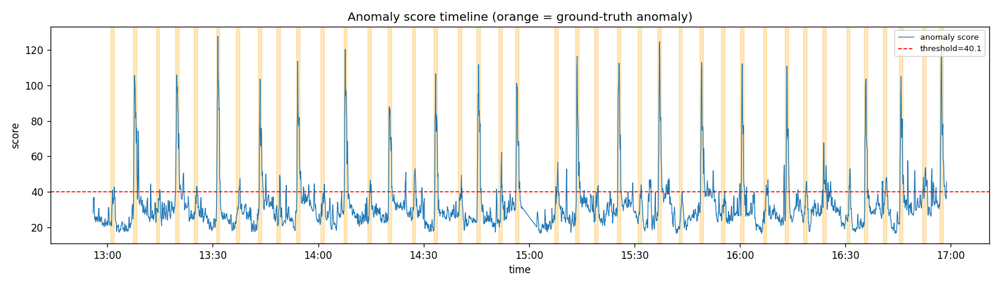
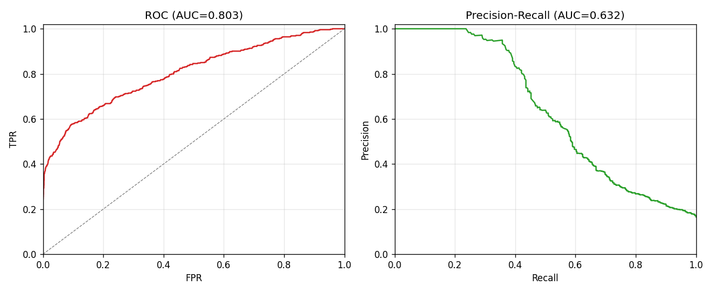
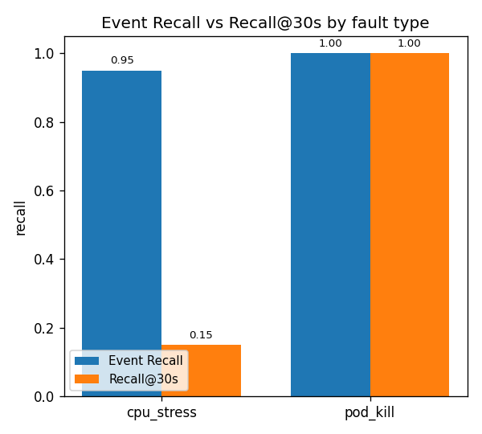
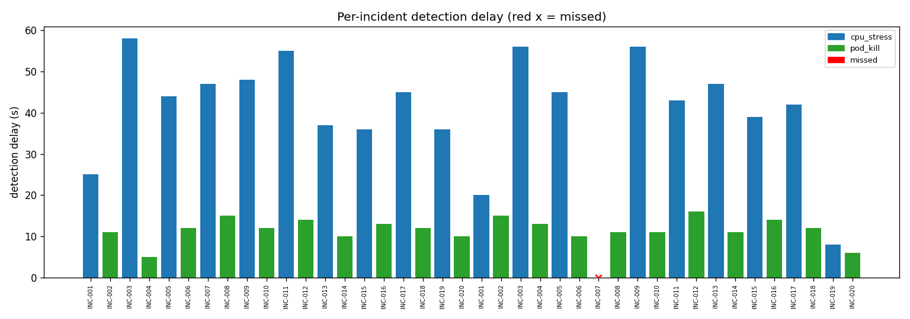
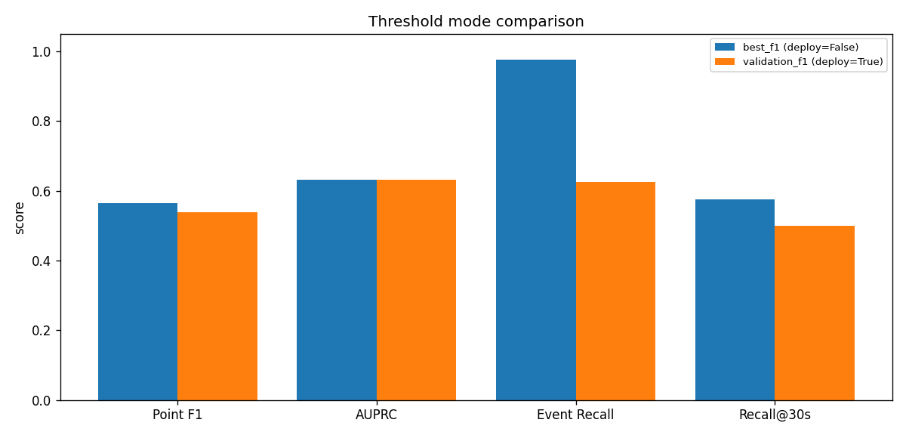

# Online Boutique AIOps Benchmark

本项目为 Online Boutique 微服务系统提供三类工具：
1. **AIOps 数据集导出管线** — 生成用于异常检测模型训练的多变量时序数据集
2. **Selenium 功能测试** — 自动化浏览器测试，验证前端功能
3. **JMeter 性能测试** — 并发负载测试，评估系统性能

---

## 目录

- [环境要求](#环境要求)
- [快速启动（环境准备）](#快速启动)
- [Selenium 功能测试](#selenium-功能测试)
- [JMeter 性能测试](#jmeter-性能测试)
- [AIOps 数据采集](#aiops-数据采集)
- [数据集文件结构](#数据集文件结构)
- [字段含义说明](#字段含义说明)

---

## 环境要求

| 工具 | 版本 | 用途 |
|------|------|------|
| Python | ≥ 3.10 | 数据采集 / Selenium 测试 |
| minikube | ≥ v1.30 | 本地 Kubernetes 集群 |
| kubectl | 与集群版本匹配 | K8s 管理 |
| istioctl | v1.26+ | 服务网格（获取 qps/latency 指标） |
| Chrome | 任意 | Selenium 主要测试浏览器 |
| Firefox | 任意（可选） | 跨浏览器兼容性测试 |
| JMeter | ≥ 5.6 | 性能测试 |

---

## 快速启动

### 1. 启动 minikube

```bash
# Windows 上需要先确认 Docker Desktop 正在运行
DOCKER_HOST="npipe:////./pipe/docker_engine" minikube start
```

### 2. 安装 Python 依赖

```bash
pip install -r requirements.txt
pip install -r tests/selenium/requirements.txt
```

### 3. 启动所有 Port-Forward（独立终端）

```bash
bash scripts/setup_port_forward.sh
```

启动后各服务地址：

| 服务 | 地址 |
|------|------|
| Online Boutique 前端 | http://localhost:8080 |
| Prometheus | http://localhost:9090 |
| Grafana | http://localhost:3000（admin/admin） |

> 脚本会自动释放已占用的端口再重新绑定，可安全重复运行。

---

## Selenium 功能测试

### 测试覆盖范围

| 测试类 | 测试用例 | 说明 |
|--------|----------|------|
| TC-B01 主页加载 | 4 | 标题、商品列表、导航栏、SLA（<10s） |
| TC-B02 商品浏览 | 3 | 点击商品、价格验证、货币切换 |
| TC-B03 购物车 | 3 | 加购、购物车内容、结账表单出现 |
| TC-B04 结账流程 | 2 | 表单可见性、端到端下单确认 |
| TC-CB 跨浏览器 | 4×2 | Chrome + Firefox 各跑一遍 |

### 运行方式

```bash
# 方式1：一键运行脚本（推荐）
bash scripts/run_selenium_tests.sh

# 方式2：只跑功能测试（Chrome headless）
bash scripts/run_selenium_tests.sh --test boutique

# 方式3：跑跨浏览器测试
bash scripts/run_selenium_tests.sh --cross-browser

# 方式4：可视化模式（浏览器窗口可见）
bash scripts/run_selenium_tests.sh --visible

# 方式5：指定浏览器
bash scripts/run_selenium_tests.sh --browser firefox

# 方式6：直接用 pytest
cd tests/selenium
export BOUTIQUE_URL=http://localhost:8080
python -m pytest test_boutique_functional.py -v \
    --html=results/report.html --self-contained-html
```

### 环境变量

| 变量 | 默认值 | 说明 |
|------|--------|------|
| `BOUTIQUE_URL` | `http://localhost:8080` | Online Boutique 前端地址 |
| `SELENIUM_BROWSER` | `chrome` | 浏览器：`chrome` / `firefox` |
| `SELENIUM_HEADLESS` | `true` | `false` 可见窗口模式 |
| `PAGE_TIMEOUT` | `30` | 页面加载超时（秒） |

### 查看测试报告

测试完成后，HTML 报告自动生成：

```
tests/selenium/results/
  report_final.html       ← 主报告，浏览器直接打开
  report_boutique.html    ← 功能测试报告
  report_cross_browser.html ← 跨浏览器报告
  timing_metrics.json     ← 页面加载时间、交互响应时间数据
  screenshots/            ← 各步骤截图（主页、购物车、订单确认等）
```

直接打开 HTML 报告：

```bash
# Windows
start tests/selenium/results/report_final.html
```

### 性能指标说明（timing_metrics.json）

每条记录格式：
```json
{
  "test": "boutique_homepage_load",
  "value_ms": 2238.0,
  "url": "http://localhost:8080",
  "browser": "chrome"
}
```

指标含义：

| 指标名 | 含义 |
|--------|------|
| `boutique_homepage_load` | 主页完整加载时间（loadEventEnd - navigationStart） |
| `boutique_homepage_sla` | SLA 检测值，目标 < 10000ms |
| `boutique_product_click_ms` | 点击商品到详情页显示的响应时间 |
| `boutique_currency_switch_ms` | 货币切换到页面更新的响应时间 |
| `boutique_add_to_cart_ms` | 点击加购到购物车页面就绪的时间 |
| `boutique_checkout_submit_ms` | 提交订单到确认页面出现的时间 |
| `cross_browser_boutique_load_chrome` | Chrome 主页加载时间 |
| `cross_browser_boutique_load_firefox` | Firefox 主页加载时间 |
| `cross_chrome_ttfb_ms` | Chrome 首字节时间（TTFB） |
| `cross_firefox_ttfb_ms` | Firefox 首字节时间（TTFB） |
| `cross_chrome_dom_load_ms` | Chrome DOMContentLoaded 时间 |
| `cross_firefox_dom_load_ms` | Firefox DOMContentLoaded 时间 |

---

## JMeter 性能测试

### 测试计划说明

**Online Boutique 测试计划** (`tests/jmeter/plans/online_boutique_load_test.jmx`)

| 场景 | 虚拟用户数 | 说明 |
|------|-----------|------|
| 场景1 正常负载 | 10 | 完整用户流程：浏览→加购→结账 |
| 场景2 中等负载 | 30 | 只读型：主页 + 商品浏览 |
| 场景3 峰值负载 | 50 | 仅主页，压测极限并发 |

每个 HTTP 请求配置了响应时间断言：主页 < 3s，加购 < 5s，下单 < 10s。

### JMeter 安装位置

JMeter 5.6.3 已安装在：`E:\apache-jmeter-5.6.3\`

可执行文件：`E:\apache-jmeter-5.6.3\bin\jmeter.bat`

### 运行方式

**方式1：命令行无头模式（推荐，自动生成 HTML 报告）**

```bash
bash scripts/run_jmeter_tests.sh --target boutique \
    --jmeter /c/jmeter/bin/jmeter.bat
```

**方式2：JMeter GUI 模式（可视化，适合调试）**

```bash
/c/jmeter/bin/jmeter.bat
# File → Open → tests/jmeter/plans/online_boutique_load_test.jmx
```

### 查看结果

```
tests/jmeter/results/
  boutique_results.jtl      ← 原始结果（CSV 格式，每行一个请求）
  boutique_report/
    index.html              ← JMeter HTML 报告（直接打开）
```

---

## AIOps 数据采集

### 工作流概览

```
多次 collect/live 采集                    assemble 合并
run_01/ ─┐
run_02/ ─┤ → data/runs/ → python -m benchmark.cli assemble → train/valid/test
run_03/ ─┤
...     ─┘
```

- 每次采集独立保存为一个 **run**（`data/runs/<run_id>/`）
- 积累 4 次以上 quality_passed=True 的 run 后，用 `assemble` 生成最终数据集
- 最后 2 次 run → test；倒数第 3 次 → valid；更早的 → train

### 模式一：Smoke 模式（Mock 数据，无需集群）

生成结构完整的样例数据集，用于验证下游模型接口。

```bash
python -m benchmark.cli smoke \
    --output data/datasets/smoke_test \
    --duration-minutes 10 \
    --step-seconds 5
```

- 生成 120 个 5s 等间隔时间点（10 分钟）
- 包含 2 个预设故障事件（INC-001 cpu_stress / INC-002 pod_kill）
- 输出标准 train/valid/test 切分格式

### 模式二：Live 模式（真实 Prometheus 数据，无故障）

从真实 Online Boutique 集群采集一段正常数据，保存为一个 run。

**前提：** minikube 运行、Istio 注入完成、port-forward 启动

```bash
# 终端1：保持 port-forward
bash scripts/setup_port_forward.sh

# 终端2：采集 run
python -m benchmark.cli live \
    --output data/runs/run_01 \
    --prometheus-url http://localhost:9090 \
    --lookback-minutes 30 \
    --step-seconds 5
```

输出到 `data/runs/run_01/`，包含 `run_x.csv`、`run_y.csv`、`run_meta.json`。

### 模式三：Collect 模式（ChaosMesh 故障注入 + 采集）

自动完成：预热 → ChaosMesh 注入 → 等待恢复 → 从 Prometheus 拉取数据 → NaN 补全 → 写出 run。

```bash
python -m benchmark.cli collect \
    --output data/runs/run_02 \
    --fault-types cpu_stress pod_kill \
    --warmup-minutes 5 \
    --gap-minutes 3
```

完整参数说明见 [docs/EXPERIMENT_GUIDE.md](docs/EXPERIMENT_GUIDE.md)。

### 模式四：Assemble（合并多次 run → 最终数据集）

积累 4 次以上 quality_passed=True 的 run 后：

```bash
python -m benchmark.cli assemble \
    --runs-root data/runs \
    --output data/datasets/online_boutique_rca_v1
```

生成标准 `train_x/valid_x/test_x` + `train_y/valid_y/test_y` 结构。

---

## 模型评测 Pipeline

数据集 assemble 完成后，用 `benchmark.pipeline` 一键完成
**标准化 → 训练 → 推理 → 评测 → 绘图**。用户只需实现 `fit` / `predict` 两个方法，
pipeline 负责其余全部环节，所有产物按时间戳写入 `output/<时间戳>_<run_name>/`，不会互相覆盖。

```python
from benchmark.pipeline import Pipeline, DatasetBundle

bundle = DatasetBundle.load("data/datasets/online_boutique_rca_full_v1")

class MyDetector:
    def fit(self, train_x, train_y, valid_x, valid_y, ctx):
        # train_x/valid_x 已用 train-only 统计量标准化（防泄露）
        ...
    def predict(self, test_x, ctx):
        return scores   # 一维异常分数，长度 == len(test_x)，越大越异常

pipe = Pipeline(bundle, run_name="my_detector", threshold_mode="validation_f1")
result = pipe.run(MyDetector())
```

完整上手示例见 [notebooks/demo_pipeline.ipynb](notebooks/demo_pipeline.ipynb)。

### 评测指标体系

`metrics.json` 分为 7 大块，覆盖点级、排序、事件级、延迟、误报、point-adjust、分组指标：

| 类别 | 指标 |
|------|------|
| 点级 | `point_precision/recall/f1/accuracy/specificity`，`TP/FP/TN/FN` |
| 排序 | `pr_auc`（AUPRC）、`roc_auc`（AUROC）；y_true 单类时为 `null` + warning |
| 事件级 | `event_recall`、`detected/missed_incidents`、`recall_at_{15,30,60}s` |
| 检测延迟 | `mean/median/p90/max_detection_delay_seconds`、逐 incident 延迟 |
| 误报 | `false_alarms_per_hour`、`alarm_ratio`、`false_positive_points` |
| point-adjust | `point_adjust_precision/recall/f1`（对齐 OmniAnomaly/USAD，仅作补充） |
| 分组 | 按 `fault_type` / `target_service` 分组的 recall / delay / point_f1 |

**事件命中规则**：某 incident 的 `[effect_start, effect_end]` 窗口内只要有一个 `y_pred=1` 即算检测到。
**检测延迟**：`delay = first_alarm_time - effect_start`，漏检不计入均值。

### 阈值模式

| 模式 | 含义 | 可部署 |
|------|------|--------|
| `best_f1` | 在 test 上最大化 F1 | ❌ 仅作性能上界（窥探测试标签） |
| `validation_f1` | 在 validation 上最大化 F1 | ✅ |
| `fixed_fpr` | validation 正常点控制目标 FPR | ✅ |

> `best_f1` 给出上界，`metrics.json` 中 `threshold_deployable=false`。pipeline 总会额外输出
> `threshold_comparison.csv/png` 并排比较 best_f1 与 validation_f1。

### 输出图表示例

每次运行生成 7 张诊断图。以高斯负对数似然基线为例：

**分数时间线**（橙带 = 真实异常区间，红线 = 阈值）



**ROC / PR 曲线**（排序质量，与阈值无关）



**按故障类型的 Event Recall vs Recall@30s** —— 最关键分组图



> 该基线对 `pod_kill` 完美检测（Recall@30s = 1.0），但对 `cpu_stress` 30 秒内仅检出 0.15，
> 清晰暴露慢传播故障的实时性短板。

**逐 incident 检测延迟**（按故障类型着色，红叉 = 漏检）



**阈值模式对比**（best_f1 上界 vs validation_f1 可部署）



完整产物清单（含 `predictions.csv`、`per_incident.csv` 等）见
[notebooks/README.md](notebooks/README.md)。

---

## 数据集文件结构

### 单次 Run 输出（live / collect 模式）

```
data/runs/run_01/
│
├── injection_log.json          ← ChaosMesh 注入记录（collect 模式）
├── run_meta.json               ← run 元信息（run_id、采集窗口、feature_count=63 等）
├── README.md
│
├── processed/
│   ├── run_x.csv               ← 本次 run 特征（timestamp + 63 列，无 NaN/Inf，无标签）
│   ├── run_y.csv               ← 本次 run 标签（is_anomaly, incident_id, phase）
│   ├── metrics_5s.csv          ← 同 run_x（完整快照）
│   ├── incidents.csv           ← 故障事件表（collect 模式）
│   ├── feature_schema.csv      ← 63 个特征的名称与含义
│   ├── norm_stats.json         ← 均值/方差（基于本次 run 全量数据）
│   └── quality_report.json     ← 质量检查报告（passed/fail_reasons）
│
├── answers/
│   ├── ground_truth.csv        ← y_true（用于评估）
│   ├── incident_ground_truth.csv
│   └── root_cause_ground_truth.csv
│
├── raw/
│   ├── prometheus_raw_long.csv
│   ├── chaos_events.csv
│   └── load_trace.csv
│
└── examples/
    └── sample_submission.csv
```

多次 run 目录下还有 `manifest.csv`（自动维护，记录所有 run 摘要）。

### 合并后数据集（assemble 模式）

```
data/datasets/online_boutique_rca_v1/
│
├── dataset_meta.json               ← 全局元信息（来源 run 列表、split 策略等）
│
├── processed/
│   ├── train_x.csv / valid_x.csv / test_x.csv   ← 特征（timestamp + 63 列）
│   ├── train_y.csv / valid_y.csv / test_y.csv   ← 标签
│   ├── incidents.csv               ← test set 的故障事件
│   └── feature_schema.csv
│
└── answers/
    ├── test_ground_truth.csv
    ├── test_incident_ground_truth.csv
    └── test_root_cause_ground_truth.csv
```

### Smoke 模式输出

同 assemble 格式，自带 train/valid/test 切分（50%/20%/30%）。

---

## 字段含义说明

### run_x.csv / train_x.csv / valid_x.csv / test_x.csv（特征文件）

**格式：** 每行一个时间点，每列一个监控指标。共 **63 个特征列** + timestamp。

| 字段名模式 | 示例 | 含义 |
|-----------|------|------|
| `timestamp` | `2026-05-29T00:00:00Z` | UTC 时间戳，ISO 8601 格式，5s 等间隔 |
| `{service}_qps` | `frontend_qps` | 服务每秒请求数（req/s）；来源：Istio `istio_requests_total` |
| `{service}_latency_p95` | `frontend_latency_p95` | P95 响应延迟（ms）；来源：Istio histogram |
| `{service}_error_rate` | `frontend_error_rate` | 5xx 错误率，范围 [0,1]；正常时为 0.0 |
| `{service}_cpu_usage` | `frontend_cpu_usage` | CPU 使用量（核心数）；来源：cAdvisor |
| `{service}_memory_usage` | `frontend_memory_usage` | 内存使用量（MiB）；来源：cAdvisor |
| `{service}_restart_count` | `frontend_restart_count` | Pod 累计重启次数；来源：kube-state-metrics |

**服务列表（11 个）：**

| 服务 | qps/latency/error_rate | cpu/memory/restart |
|------|------------------------|-------------------|
| frontend, cartservice, checkoutservice, currencyservice, emailservice, paymentservice, productcatalogservice, recommendationservice, shippingservice, adservice | ✓（HTTP via Istio） | ✓ |
| redis-cart | ✗（TCP 协议，无 HTTP 指标，**特征已移除**） | ✓ |

**特征数：** 10 服务 × 6 指标 + redis-cart × 3 资源指标 = **63**

**NaN 处理策略（live/collect 采集时自动执行）：**

| 情况 | 策略 |
|------|------|
| error_rate / latency_p95 为 NaN 且 qps=0 | 填 0.0（无流量时正常） |
| cpu_usage / memory_usage / restart_count 缺失 ≤2 个连续点 | Forward fill（短暂 scrape 缺口） |
| 超出以上范围仍有 NaN | `quality_report.passed=False`，命令以非零退出 |

---

### run_y.csv / train_y.csv / valid_y.csv / test_y.csv（标签文件）

| 字段 | 类型 | 含义 |
|------|------|------|
| `timestamp` | string | UTC 时间戳，与对应 x 文件完全对齐 |
| `is_anomaly` | int (0/1) | 该时间点是否为异常：1=异常，0=正常 |
| `incident_id` | string | 所属故障事件 ID（如 `INC-001`），正常点为空 |
| `phase` | string | 时间点阶段：`normal` / `fault_effect` |

---

### incidents.csv（故障事件表）

| 字段 | 含义 |
|------|------|
| `incident_id` | 事件唯一 ID（如 `INC-001`） |
| `injection_start` | 故障注入开始时间（UTC ISO） |
| `injection_end` | 故障注入结束时间（UTC ISO） |
| `effect_start` | 异常效应开始时间（评估标签用此字段） |
| `effect_end` | 异常效应结束时间 |
| `recovery_end` | 恢复完成时间 |
| `fault_type` | 故障类型：`cpu_stress` / `pod_kill` / `network_delay` |
| `target_service` | 直接注入故障的目标服务 |
| `root_cause_service` | 根因服务（可能与 target 不同） |
| `severity` | 故障严重程度：`low` / `medium` / `high` / `critical` |
| `duration_sec` | 故障持续秒数（1分钟故障=60） |
| `valid_incident` | 是否为有效故障事件（`true`/`false`） |
| `root_cause_dims` | 根因特征维度，分号分隔 |
| `secondary_dims` | 受波及的次级维度，分号分隔 |

---

### feature_schema.csv（特征元数据）

63 行，每行对应一个特征。

| 字段 | 含义 |
|------|------|
| `feature_name` | 特征全名（格式：`{service}_{metric_type}`） |
| `service` | 所属微服务名称 |
| `metric_type` | 指标类型：`qps` / `latency_p95` / `error_rate` / `cpu_usage` / `memory_usage` / `restart_count` |
| `unit` | 单位：`req/s` / `ms` / `ratio` / `cores` / `MiB` / `count` |
| `source` | 数据来源：`prometheus` |
| `model_input` | 是否作为模型输入（均为 `True`） |
| `expected_min` | 该指标的预期最小值 |
| `expected_max` | 该指标的预期最大值 |

---

### norm_stats.json（标准化统计量）

```json
{
  "fit_on": "run_all",
  "features": {
    "frontend_qps": {
      "mean": 2.51,
      "std": 0.18,
      "min": 2.20,
      "max": 2.82
    }
  }
}
```

| 字段 | 含义 |
|------|------|
| `fit_on` | `run_all`（live/collect run 用全量数据）或 `train_only`（smoke/assembled 用训练集） |
| `features.{name}.mean/std/min/max` | 该特征的统计量 |

---

### quality_report.json（质量检查报告）

live/collect run 用严格硬校验，任意一条失败则 `passed=False` 且命令以非零退出。

| 字段 | 含义 |
|------|------|
| `row_count` | 总时间点数 |
| `feature_count` | 特征数（应为 **63**） |
| `schema_feature_count` | feature_schema.csv 行数（应为 **63**） |
| `is_regular_interval` | 时间戳是否 5s 等间隔（true=通过） |
| `duplicate_timestamp_count` | 重复时间戳数（应为 0） |
| `nan_count` | run_x 中 NaN 总数（应为 0） |
| `inf_count` | Inf 总数（应为 0） |
| `constant_feature_count` | 常量特征数（方差为 0，仅供参考） |
| `run_rows` | 本次 run 行数 |
| `anomaly_points` | 异常点数（normal run 为 0，chaos run 必须 > 0） |
| `anomaly_ratio` | 异常比例 |
| `incident_count` | 故障事件数 |
| `valid_incident_count` | 有效故障事件数 |
| `x_has_no_label_columns` | run_x 不含标签列（true=通过） |
| `imputation_strategy` | NaN 补全策略名称 |
| `imputed_value_count` | 本次补全的值总数 |
| `imputed_features` | 各特征的补全数量（dict） |
| `missing_features` | 无法从 Prometheus 获取数据的特征列表 |
| `ground_truth_consistent` | ground_truth.y_true 与 run_y.is_anomaly 是否一致 |
| `rca_dims_valid` | root_cause_dims 是否全部存在于 feature_schema |
| `fail_reasons` | 所有失败原因列表（passed=True 时为空） |
| `passed` | 质量检查是否全部通过 |

---

### run_meta.json（run 元信息）

| 字段 | 含义 |
|------|------|
| `run_id` | run 唯一标识（默认为输出目录名） |
| `mode` | `live` / `collect` |
| `dataset_type` | `run_collection` |
| `run_type` | `normal`（无注入）/ `chaos`（有故障注入） |
| `collection_start` / `collection_end` | 采集时间窗口（UTC） |
| `sampling_interval_seconds` | 采样间隔（秒） |
| `feature_count` | 63 |
| `services` | 11 个微服务列表 |
| `chaos_enabled` | 是否启用 ChaosMesh |
| `prometheus_url` | Prometheus 地址 |
| `incidents_count` | 故障事件数 |
| `anomaly_points` | 异常点数 |
| `timezone` | UTC |

---

### answers/ground_truth.csv（点级别评估答案）

| 字段 | 含义 |
|------|------|
| `timestamp` | UTC 时间戳，与 `run_x.csv` 完全对齐 |
| `y_true` | 真实标签：1=异常，0=正常 |

---

### answers/root_cause_ground_truth.csv（根因评估答案）

| 字段 | 含义 |
|------|------|
| `incident_id` | 故障事件 ID |
| `root_cause_service` | 根因微服务名 |
| `root_cause_dims` | 根因特征维度（分号分隔） |
| `fault_type` | 故障类型 |

---

### examples/sample_submission.csv（模型提交模板）

| 字段 | 含义 |
|------|------|
| `timestamp` | UTC 时间戳，与 `run_x.csv` 完全对齐 |
| `anomaly_score` | 模型输出的异常分数（越高越异常，初始填 0） |
| `y_pred` | 模型二值预测：1=异常，0=正常（初始填 0） |

---

### dataset_meta.json（assemble 模式全局元信息）

| 字段 | 含义 |
|------|------|
| `dataset_name` | 数据集名称 |
| `assembled_from` | 参与合并的所有 run_id 列表 |
| `train_runs` / `valid_runs` / `test_runs` | 各 split 对应的 run_id |
| `split_policy` | 划分策略：`last3_valid_last2_test` |
| `created_at` | 生成时间（UTC） |
| `feature_count` | 63 |
| `services` | 11 个微服务列表 |
| `train_rows` / `valid_rows` / `test_rows` | 各切分行数 |
| `test_anomaly_points` | 测试集异常点数 |
