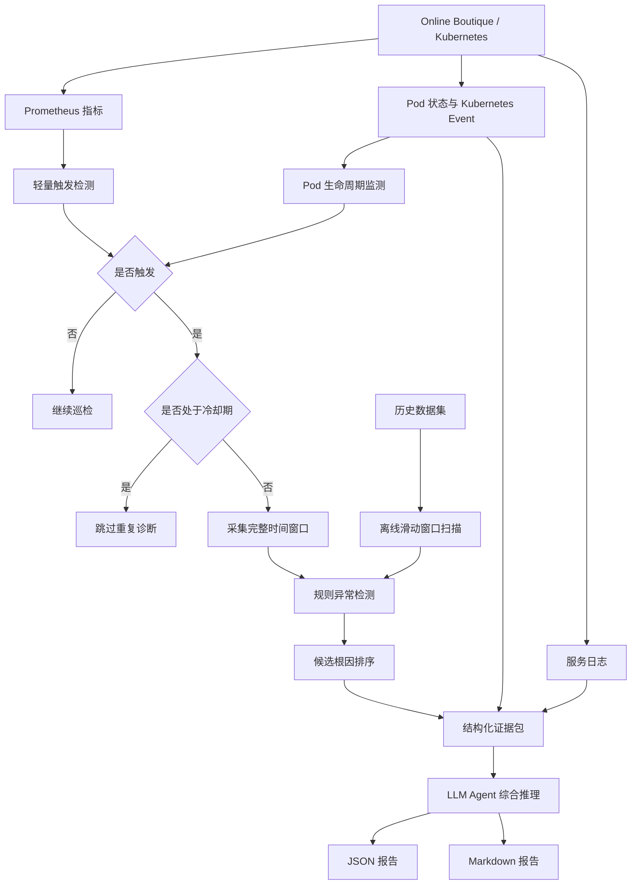

# AIOps Agent：面向 Kubernetes 微服务的智能运维诊断系统

本项目实现了一个面向 Kubernetes 微服务环境的智能运维 Agent，支持**在线实时巡检**和**离线历史故障分析**。

系统以 Online Boutique 为主要验证对象，结合 Prometheus 指标、Kubernetes Pod 生命周期、Kubernetes Event、服务日志、规则检测、候选根因排序和 LLM 工具调用，完成异常发现、证据收集、根因分析和诊断报告生成。

---

## 1. 系统架构



系统采用“**规则检测 + LLM 解释**”的分层设计：

- 规则模块负责指标异常检测和候选根因排序；
- LLM 负责证据整合、工具调用、不确定性说明和处置建议；
- 在线与离线模式复用同一套检测和诊断逻辑；
- 默认只执行诊断，不自动重启服务。

---

## 2. 主要功能

### 在线模式

- 定时从 Prometheus 采集 CPU、内存、QPS、延迟、错误率和重启次数；
- 对关键指标执行动态阈值检测；
- 监测 Pod 名称、UID 和 Ready 状态变化；
- 识别 Pod 删除和自动重建；
- 查询 Kubernetes Event、Pod 状态和服务日志；
- 对异常服务进行候选根因排序；
- 调用 LLM 生成综合诊断结论；
- 输出 JSON 和 Markdown 报告；
- 支持冷却期去重，避免同一异常重复生成报告。

### 离线模式

- 加载历史监控数据集；
- 使用滑动窗口扫描异常时间段；
- 分析指定窗口中的异常指标和异常服务；
- 输出候选根因服务排序；
- 生成离线诊断报告。

### Agent 工具

在线 Agent 可使用：

- `execute_promql`：查询 Prometheus 指标；
- `get_service_logs`：查询服务日志；
- `get_pod_status`：查询 Pod 和容器状态；
- `get_kubernetes_events`：查询 Kubernetes Event；
- `restart_pod`：重启目标 Deployment，默认关闭。

---

## 3. 项目结构

```text
aiops_agent/
├─ main.py                     # 在线/离线统一入口
├─ config.yaml                 # LLM 配置
│
├─ offline/
│  ├─ loader.py                # 历史数据加载
│  ├─ detector.py              # 异常检测
│  ├─ diagnoser.py             # 根因候选排序
│  └─ reporter.py              # 离线报告生成
│
├─ online/
│  ├─ collector.py             # Prometheus 指标采集
│  ├─ lifecycle.py             # Pod 生命周期监测
│  ├─ monitor.py               # 在线巡检主循环
│  ├─ tools.py                 # PromQL、日志、Pod、Event 工具
│  ├─ reasoner.py              # LLM 综合推理
│  ├─ prompts.py               # 在线提示词
│  └─ reporter.py              # 在线报告生成
│
├─ veadk_app/                  # 离线 Agent 与工具封装
└─ output/
   ├─ online_reports/          # 在线报告
   └─ veadk_reports/           # 离线报告
```

项目还依赖仓库根目录中的：

```text
data/datasets/online_boutique_rca_full_v1/
configs/prometheus_queries.yaml
scripts/inject_pod_kill.py
scripts/inject_cpu_stress.py
```

---

## 4. 环境要求

- Python 3.10 及以上；
- Kubernetes 或 Minikube；
- 已安装并配置 `kubectl`；
- 已部署 Online Boutique；
- 已部署 Prometheus；
- Python 依赖：

```bash
pip install pandas requests pyyaml veadk
```

项目运行前应确认：

```powershell
kubectl get pods -n online-boutique
```

Prometheus 默认地址：

```text
http://127.0.0.1:9090
```

LLM 配置文件：

```text
aiops_agent/config.yaml
```

示例：

```yaml
model:
  agent:
    provider: openai
    name: your-model-name
    api_base: https://your-api-endpoint/v1/
    api_key: your-api-key
```

---

## 5. 启动方法

所有命令均在项目根目录执行。

### 在线持续巡检

```powershell
python -m aiops_agent.main `
  --mode online `
  --prometheus-url http://127.0.0.1:9090 `
  --namespace online-boutique `
  --interval-seconds 10 `
  --cooldown-seconds 60
```

正常状态下会输出：

```text
[初始化] 已记录 N 个 Pod，后续将检测 Pod 删除和重建。
[HH:MM:SS] 未触发在线诊断：未命中任何触发阈值；Pod 快照未发现删除或重建变化。
```

### 在线单次巡检

```powershell
python -m aiops_agent.main `
  --mode online `
  --once `
  --prometheus-url http://127.0.0.1:9090 `
  --namespace online-boutique
```

### 禁用 LLM

```powershell
python -m aiops_agent.main `
  --mode online `
  --once `
  --disable-llm
```

### 启动离线模式

```powershell
python -m aiops_agent.main --mode offline
```

也可以直接执行一次完整离线分析：

```powershell
python -m aiops_agent.main `
  --mode offline `
  --prompt "请扫描 valid split 中最异常的3个窗口，继续分析排名第一的窗口并生成报告。"
```

---

## 6. 报告输出

在线报告默认输出到：

```text
aiops_agent/output/online_reports/
```

离线报告默认输出到：

```text
aiops_agent/output/veadk_reports/
```

每次诊断会生成：

```text
*.json
*.md
```

报告主要包括：

- 事件概览；
- 触发原因；
- 异常服务；
- 关键指标证据；
- Kubernetes 生命周期证据；
- 候选根因排序；
- LLM 综合解释；
- 缺失观测；
- 建议动作；
- 工具调用轨迹。

---

## 7. 已完成测试

### 正常巡检测试

验证结果：

- 正常状态下不触发深度诊断；
- 不生成重复报告；
- 不调用 LLM；
- 终端持续输出正常巡检状态。

### Pod Kill 测试

目标服务：

```text
redis-cart
```

验证内容：

- 检测到旧 Pod 消失；
- 检测到 ReplicaSet 创建替代 Pod；
- 自动查询 Pod 状态和 Kubernetes Event；
- 根因 Top-1 为 `redis-cart`；
- 成功生成 JSON 和 Markdown 报告；
- 冷却期内不重复生成报告。

### CPU Stress 测试

目标服务：

```text
redis-cart
```

验证内容：

- `redis-cart_cpu_usage` 超过动态阈值；
- 由 Prometheus 指标触发深度诊断；
- 未误判为 Pod 生命周期故障；
- 根因 Top-1 为 `redis-cart`；
- 成功生成 JSON 和 Markdown 报告。

### 测试结果

| 测试场景 | 触发类型 | 目标服务 | Agent Top-1 | 结果 |
|---|---|---|---|---|
| 正常巡检 | 无 | 无 | 无 | 通过 |
| Pod Kill | Kubernetes 生命周期 | redis-cart | redis-cart | 通过 |
| CPU Stress | Prometheus CPU 超阈 | redis-cart | redis-cart | 通过 |
| 冷却去重 | 重复异常 | 同一事件 | 跳过重复诊断 | 通过 |

---

## 8. 说明

当前系统采用规则检测和启发式根因排序，输出的是**候选根因服务**，用于辅助诊断，不代表严格的因果证明。

在线模式是当前项目的重点，已经完成 Pod Kill 和 CPU Stress 两类故障验证；离线模式主要用于历史异常窗口扫描和故障复盘。
